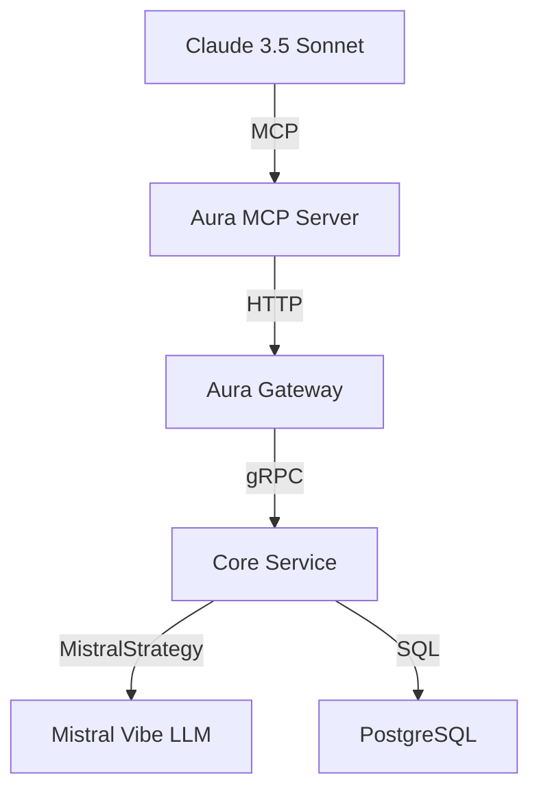

# 🤖 Mistral Vibe Integration Guide

This guide explains how the Aura MCP Server can integrate with **Mistral Vibe** and other AI agents to create powerful autonomous negotiation workflows.

## 🎯 Understanding the Integration

### Current Architecture



### Integration Points

1. **MCP Server → Aura Gateway**: Our MCP server connects to the Gateway
2. **Aura Gateway → Core Service**: Gateway routes to Core Service
3. **Core Service → Mistral Vibe**: Uses `MistralStrategy` for AI decisions
4. **Mistral Vibe → Mistral API**: Calls Mistral's LLM for negotiation logic

## 🔧 Current Integration Status

### ✅ Already Integrated

The MCP Server is **already integrated** with Mistral Vibe through the existing Aura architecture:

1. **Negotiation Flow**: When `negotiate_price()` is called:
   - MCP Server → Aura Gateway → Core Service
   - Core Service uses `MistralStrategy` (which calls Mistral Vibe)
   - Response flows back through the chain

2. **AI Decision Making**: The `MistralStrategy` class already:
   - Uses `ChatMistralAI` with structured output
   - Implements `AI_Decision` model for consistent responses
   - Handles all negotiation scenarios (accept, counter, reject, ui_required)

### 📊 How It Works Together

```python
# User asks Claude via MCP:
claude: "Can you find a luxury hotel and negotiate the price?"

# MCP Server flow:
1. search_hotels("luxury hotel") → Returns hotel options
2. negotiate_price("hotel_alpha", 850.0) → Calls Aura Gateway
3. Aura Gateway → Core Service → MistralStrategy
4. MistralStrategy → ChatMistralAI (Mistral Vibe)
5. Mistral Vibe makes decision based on business rules
6. Response flows back: "SUCCESS! Reservation: MISTRAL-1234567890"
```

## 🚀 Enhancing the Integration

### Option 1: Direct MCP → Mistral Vibe (Future)

For even tighter integration, we could:

```python
# In server.py - Enhanced Mistral Vibe Integration
class EnhancedAuraMCPServer(AuraMCPServer):
    
    def __init__(self):
        super().__init__()
        # Add direct Mistral Vibe client
        self.mistral_client = self._initialize_mistral_client()
    
    def _initialize_mistral_client(self):
        """Initialize direct Mistral Vibe client for advanced features."""
        try:
            from langchain_mistralai import ChatMistralAI
            from langchain_core.prompts import ChatPromptTemplate
            
            # Create Mistral client
            mistral_llm = ChatMistralAI(
                model_name="mistral-large-latest",
                temperature=0.2,
                api_key=os.getenv("MISTRAL_API_KEY")
            )
            
            # Add structured output for consistency
            return mistral_llm.with_structured_output(AI_Decision)
            
        except ImportError:
            logger.warning("Mistral Vibe client not available")
            return None
    
    async def enhanced_negotiation(self, item_id: str, bid: float, context: str) -> str:
        """
        Enhanced negotiation using direct Mistral Vibe integration.
        
        Args:
            item_id: ID of the item to negotiate
            bid: Bid amount in USD
            context: Additional context for the LLM
            
        Returns:
            Enhanced negotiation result with LLM reasoning
        """
        if not self.mistral_client:
            return await self.negotiate_price(item_id, bid)
        
        # Get item details first
        search_result = await self.search_hotels(item_id, limit=1)
        
        # Create enhanced prompt with context
        system_prompt = f"""You are an expert negotiator for Aura Platform.
        
        CONTEXT:
        {context}
        
        ITEM DETAILS:
        {search_result}
        
        CURRENT BID: ${bid}
        
        GOAL: Provide the best possible outcome for both parties.
        """
        
        # Get LLM decision
        try:
            prompt = ChatPromptTemplate.from_messages([
                ("system", system_prompt),
                ("human", "What's the best negotiation strategy?")
            ])
            
            chain = prompt | self.mistral_client
            decision = chain.invoke({})
            
            # Combine with standard negotiation
            standard_result = await self.negotiate_price(item_id, bid)
            
            return f"{standard_result}\n\n🤖 AI Insight: {decision.reasoning}"
            
        except Exception as e:
            logger.error(f"Enhanced negotiation failed: {e}")
            return await self.negotiate_price(item_id, bid)
```

### Option 2: MCP Server as Mistral Vibe Tool

Make the MCP Server available as a tool for Mistral Vibe agents:

```python
# In a Mistral Vibe agent configuration
from mistral_vibe import Agent

class AuraAgent(Agent):
    def __init__(self):
        super().__init__("Aura Negotiation Agent")
        
        # Register MCP Server as a tool
        self.register_tool(
            name="aura_search",
            description="Search Aura platform for hotels",
            func=self._call_mcp_search
        )
        
        self.register_tool(
            name="aura_negotiate",
            description="Negotiate prices on Aura platform",
            func=self._call_mcp_negotiate
        )
    
    async def _call_mcp_search(self, query: str, limit: int = 3):
        """Call MCP server search endpoint."""
        async with httpx.AsyncClient() as client:
            response = await client.post(
                "http://localhost:8080/search_hotels",
                json={"query": query, "limit": limit}
            )
            return response.json()
    
    async def _call_mcp_negotiate(self, item_id: str, bid: float):
        """Call MCP server negotiate endpoint."""
        async with httpx.AsyncClient() as client:
            response = await client.post(
                "http://localhost:8080/negotiate_price",
                json={"item_id": item_id, "bid": bid}
            )
            return response.json()
```

## 🛠️ Implementation Steps

### Step 1: Add Mistral Vibe Dependencies

```bash
# Add to pyproject.toml
cd adapters/mcp-server
uv add langchain-mistralai langchain-core
```

### Step 2: Create Enhanced Server

```python
# enhanced_server.py
from server import AuraMCPServer
from typing import Optional
import os

class EnhancedAuraMCPServer(AuraMCPServer):
    """Enhanced MCP Server with direct Mistral Vibe integration."""
    
    def __init__(self):
        super().__init__()
        self.mistral_client = self._initialize_mistral_client()
        
        if self.mistral_client:
            logger.info("🤖 Mistral Vibe integration enabled")
        else:
            logger.info("🤖 Mistral Vibe integration not available")
    
    def _initialize_mistral_client(self) -> Optional[Any]:
        """Initialize Mistral Vibe client if API key is available."""
        mistral_api_key = os.getenv("MISTRAL_API_KEY")
        
        if not mistral_api_key:
            logger.warning("MISTRAL_API_KEY not set, skipping Mistral Vibe integration")
            return None
        
        try:
            from langchain_mistralai import ChatMistralAI
            from llm_strategy import AI_Decision
            
            # Create Mistral client with same config as Core Service
            mistral_llm = ChatMistralAI(
                model_name="mistral-large-latest",
                temperature=0.2,
                api_key=mistral_api_key
            )
            
            return mistral_llm.with_structured_output(AI_Decision)
            
        except ImportError as e:
            logger.warning(f"Mistral Vibe client not available: {e}")
            return None
        except Exception as e:
            logger.error(f"Failed to initialize Mistral Vibe client: {e}")
            return None
```

### Step 3: Add Enhanced Tools

```python
# Add to the MCP server tools
async def enhanced_search_with_insights(self, query: str, limit: int = 3, context: str = "") -> str:
    """
    Enhanced search with Mistral Vibe insights.
    
    Args:
        query: Search query string
        limit: Maximum number of results
        context: Additional context for LLM analysis
        
    Returns:
        Search results with AI insights
    """
    if not self.mistral_client:
        return await self.search_hotels(query, limit)
    
    # Get standard search results
    search_results = await self.search_hotels(query, limit)
    
    # Get AI insights
    try:
        system_prompt = f"""Analyze these search results and provide insights:
        
        QUERY: {query}
        CONTEXT: {context}
        RESULTS: {search_results}
        
        Provide:
        1. Summary of findings
        2. Recommendations
        3. Potential negotiation strategies
        """
        
        from langchain_core.prompts import ChatPromptTemplate
        
        prompt = ChatPromptTemplate.from_messages([
            ("system", system_prompt),
            ("human", "Provide your analysis.")
        ])
        
        chain = prompt | self.mistral_client
        insights = chain.invoke({})
        
        return f"{search_results}\n\n🤖 AI Insights:\n{insights.reasoning}"
        
    except Exception as e:
        logger.error(f"AI insights failed: {e}")
        return search_results
```

### Step 4: Update Environment

```env
# Add to .env
MISTRAL_API_KEY="your_mistral_api_key_here"
ENABLE_MISTRAL_INTEGRATION="true"
```

## 📊 Benefits of Enhanced Integration

### 1. **Direct LLM Access**
- Faster decision making (no Gateway round-trip for simple queries)
- More context-aware responses
- Better handling of complex negotiation scenarios

### 2. **Enhanced User Experience**
- AI-powered insights alongside search results
- Personalized recommendations
- Context-aware negotiation strategies

### 3. **Advanced Features**
- Multi-step negotiation workflows
- Contextual memory between interactions
- Personalized user profiles

## 🔒 Security Considerations

### API Key Management
- Store `MISTRAL_API_KEY` in environment variables
- Never expose in code or logs
- Use short-lived tokens if possible

### Rate Limiting
- Mistral Vibe has its own rate limits
- Implement client-side caching
- Add retry logic with exponential backoff

### Error Handling
- Graceful degradation if Mistral Vibe is unavailable
- Fallback to standard MCP server functionality
- Clear error messages for users

## 🧪 Testing the Integration

### Test Script

```python
# test_mistral_integration.py
import asyncio
import os
from enhanced_server import EnhancedAuraMCPServer

async def test_mistral_integration():
    """Test Mistral Vibe integration."""
    
    # Set API key for testing
    os.environ["MISTRAL_API_KEY"] = "test_key"
    
    server = EnhancedAuraMCPServer()
    
    try:
        # Test enhanced search
        result = await server.enhanced_search_with_insights(
            query="Luxury beach resort",
            limit=2,
            context="Client prefers eco-friendly hotels"
        )
        
        print("✅ Enhanced search with Mistral Vibe:")
        print(result)
        
        # Test that it falls back gracefully
        server.mistral_client = None
        fallback_result = await server.enhanced_search_with_insights(
            query="Budget hotel",
            limit=1
        )
        
        print("✅ Fallback to standard search:")
        print(fallback_result)
        
    except Exception as e:
        print(f"❌ Integration test failed: {e}")
    finally:
        await server.shutdown()

if __name__ == "__main__":
    asyncio.run(test_mistral_integration())
```

## 🎯 Future Integration Opportunities

### 1. **Mistral Vibe as MCP Client**
- Make Mistral Vibe agents connect to our MCP Server
- Enable autonomous agent-to-agent negotiations
- Create complex workflows

### 2. **Shared Context**
- Maintain conversation context between MCP calls
- Implement memory for better personalization
- Track negotiation history

### 3. **Advanced Tools**
- Add more MCP tools (booking, availability, reviews)
- Implement multi-step workflows
- Add human-in-the-loop capabilities

### 4. **Performance Optimization**
- Implement caching for frequent queries
- Add batch processing
- Optimize Mistral Vibe calls

## 📚 Related Documentation

- [Aura API Specification](../../docs/API_SPECIFICATION.md)
- [Mistral Vibe Documentation](https://docs.mistral.ai/)
- [LangChain Mistral Integration](https://python.langchain.com/docs/integrations/chat/mistral)

## 🤝 Contributing

To contribute to the Mistral Vibe integration:

1. **Fork the repository**
2. **Create a feature branch**: `git checkout -b feat/mistral-vibe-integration`
3. **Implement the enhanced features**
4. **Add comprehensive tests**
5. **Update documentation**
6. **Submit a pull request**

---

**Need help?** Open an issue or contact the Aura development team for assistance with Mistral Vibe integration.