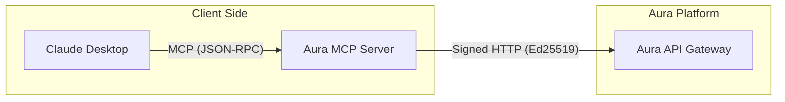

# Aura MCP Server

**The Official Model Context Protocol (MCP) Adapter for Aura Platform**

This package allows AI agents (like Claude Desktop, Cursor, or custom LLM apps) to natively discover and interact with the Aura Negotiation Platform. It acts as a **Smart Client** that handles cryptographic signing, so the LLM can focus on reasoning.

---

## 🎯 Features

- **Zero-Config Security**: Automatically generates an Ed25519 session wallet on startup.
- **Protocol Translation**: Converts simple MCP tool calls into signed HTTP requests for the Aura Gateway.
- **Toolbox**:
  - `search_hotels(query)`: Semantic search powered by Vector DB.
  - `negotiate_price(id, bid)`: Complex negotiation logic with polymorphic responses.
- **Cross-Platform**: Distributable via PyPI / `uvx`.

---

## 🚀 Quick Start (No Installation Required)

If you have [`uv`](https://github.com/astral-sh/uv) installed, you can run the server directly from the source without cloning the repo.

### Connecting to Claude Desktop

Add this to your Claude Desktop configuration file:

**macOS**: `~/Library/Application Support/Claude/claude_desktop_config.json`  
**Windows**: `%APPDATA%\Claude\claude_desktop_config.json`

```json
{
  "mcpServers": {
    "aura": {
      "command": "uv",
      "args": [
        "run",
        "--with", "fastmcp",
        "--with", "httpx", 
        "--with", "pynacl",
        "--with", "python-dotenv",
        "https://github.com/YOUR_USERNAME/aura-platform/blob/main/adapters/mcp-server/src/aura_mcp/main.py" 
        # Note: In a real release, you would point to a PyPI package name
      ],
      "env": {
        "AURA_GATEWAY_URL": "http://localhost:8000"
      }
    }
  }
}
```

*(Note: If you are developing locally, replace the URL with the local path to the `adapters/mcp-server` directory).*

---

## 🛠️ Local Development

If you are contributing to Aura or running the platform locally.

### 1. Prerequisites

- Python 3.10+
- `uv` package manager
- Aura Platform running (`docker-compose up` in root)

### 2. Installation

Navigate to the adapter directory:

```bash
cd adapters/mcp-server
uv sync
```

### 3. Running

You can run the server in development mode (with hot reload capabilities provided by `fastmcp` if configured, or just standard run):

```bash
# Run as a module (Recommended)
uv run aura-mcp

# Or via direct file execution (if needed for debug)
uv run src/aura_mcp/main.py
```

---

## 🤖 Usage with LLMs

Once connected, the LLM will see two tools. Here is how it interacts with them:

### `search_hotels`

**User Prompt:** "Find me a cheap hostel in Bali."
**LLM Call:** `search_hotels(query="cheap hostel bali", limit=3)`
**MCP Response:**
```text
🏨 Search Results:
1. Backpacker Hostel Beta - $50.00 (Score: 0.89)
   Details: {"stars": 2, "location": "Bali"}
```

### `negotiate_price`

**User Prompt:** "Try to get it for $40."
**LLM Call:** `negotiate_price(item_id="hostel_beta", bid=40.0)`
**MCP Response:**
```text
🔄 COUNTER-OFFER: $45.00.
Message: We can't go lower than $45 due to high season.
```

---

## 🧩 Configuration

The server is configured via Environment Variables.

| Variable | Default | Description |
| :--- | :--- | :--- |
| `AURA_GATEWAY_URL` | `http://localhost:8000` | URL of the Aura API Gateway |
| `LOG_LEVEL` | `INFO` | Logging verbosity (DEBUG, INFO, ERROR) |

---

## 🏗️ Architecture

This adapter follows the **Hexagonal Architecture** of the Aura Platform.



The MCP Server is a **Driving Adapter** that translates User Intent (via LLM) into Protocol Actions.

---

## 🧪 Testing

To test the logic without an LLM, you can use the `mcp-cli` inspector or a simple python script:

```bash
# Install inspector
uv tool install mcp-cli

# Inspect the server
uv run mcp-cli --server-script "uv run aura-mcp"
```

Or run a manual test script:

```python
# test_flow.py
from aura_mcp.main import mcp

# Simulate a tool call
result = mcp.call_tool("search_hotels", arguments={"query": "luxury"})
print(result)
```

Run with: `uv run test_flow.py`

---

## 📄 License

MIT License. See [LICENSE](../../LICENSE) in the root directory.
