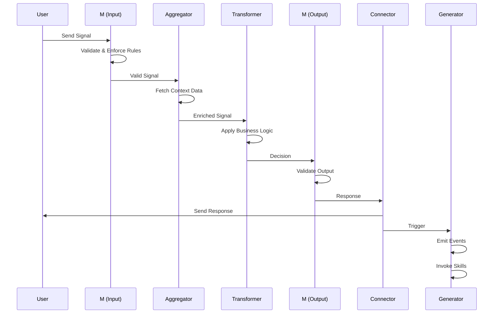

# ATCG-M Metabolism

The **ATCG-M** pattern is a fractal protocol that defines how signals flow through the Hive. Like DNA nucleotides (A, T, C, G), these five protocols combine to create complex behaviors from simple building blocks.

## The Five Nucleotides

### M (Membrane) - Input
**Purpose**: Sovereignty enforcement and validation

**Responsibilities**:
- Validate input signals against constraints
- Rate limiting and circuit breaking
- Permission/authorization checks
- Business rule enforcement (e.g., minimum bid)

**Example**:
```python
def membrane_in(signal: Signal) -> Signal:
    # Validate bid amount
    if signal.intent.params["bid_amount"] < floor_price:
        raise ValueError("Bid below floor price")

    # Check rate limits
    if not rate_limiter.allow(signal.context.user_id):
        raise ValueError("Rate limit exceeded")

    return signal
```

### A (Aggregator) - Gather Context
**Purpose**: Collect all data needed for decision-making

**Responsibilities**:
- Fetch related data from databases
- Query external APIs
- Retrieve user history
- Assemble complete context

**Example**:
```python
async def aggregator(signal: Signal) -> EnrichedSignal:
    item = await db.items.get(signal.intent.params["item_id"])
    user = await db.users.get(signal.context.user_id)
    history = await db.negotiations.get_user_history(user.id)

    return EnrichedSignal(
        signal=signal,
        item=item,
        user=user,
        history=history
    )
```

### T (Transformer) - Make Decisions
**Purpose**: Core business logic and state transitions

**Responsibilities**:
- Analyze enriched context
- Apply business rules
- Make decisions (accept/reject/counter)
- Transform signal to next state

**Example**:
```python
def transformer(enriched: EnrichedSignal) -> Decision:
    bid_amount = enriched.signal.intent.params["bid_amount"]

    if bid_amount >= enriched.item.asking_price:
        return Decision(outcome="accept", message="Bid accepted!")

    elif bid_amount >= enriched.item.floor_price * 0.9:
        counter = enriched.item.floor_price * 0.95
        return Decision(
            outcome="counter",
            counter_amount=counter,
            message=f"Counter offer: ${counter}"
        )

    else:
        return Decision(outcome="reject", message="Bid too low")
```

### M (Membrane) - Output
**Purpose**: Validate output and enforce post-conditions

**Responsibilities**:
- Ensure response meets schema requirements
- Apply output transformations
- Enforce business constraints on results
- Sanitize sensitive data

**Example**:
```python
def membrane_out(decision: Decision, signal: Signal) -> Response:
    # Ensure counter offers meet minimum
    if decision.outcome == "counter":
        if decision.counter_amount < signal.intent.params["bid_amount"] * 1.05:
            decision.counter_amount = signal.intent.params["bid_amount"] * 1.05

    # Sanitize response
    return Response(
        outcome=decision.outcome,
        message=decision.message,
        counter_amount=decision.counter_amount if decision.outcome == "counter" else None
    )
```

### C (Connector) - Route Response
**Purpose**: Send response to the right destination

**Responsibilities**:
- Route message to requester (HTTP, WebSocket)
- Send notifications (email, SMS, push)
- Update external systems
- Trigger downstream workflows

**Example**:
```python
async def connector(response: Response, signal: Signal) -> None:
    # Send HTTP response back to API gateway
    await nats.publish(
        f"hive.api.response.{signal.context.request_id}",
        response.to_bytes()
    )

    # Send notification to user
    if response.outcome == "counter":
        await send_notification(
            signal.context.user_id,
            f"Counter offer: ${response.counter_amount}"
        )
```

### G (Generator) - Emit Events
**Purpose**: Broadcast state changes and trigger side effects

**Responsibilities**:
- Emit domain events (bid_placed, offer_accepted)
- Trigger analytics tracking
- Update search indexes
- Invoke skills (external capabilities)

**Example**:
```python
async def generator(response: Response, signal: Signal) -> None:
    # Emit domain event
    await nats.publish(
        "hive.events.bid_placed",
        BidPlacedEvent(
            item_id=signal.intent.params["item_id"],
            user_id=signal.context.user_id,
            bid_amount=signal.intent.params["bid_amount"],
            outcome=response.outcome,
            timestamp=datetime.utcnow()
        ).to_bytes()
    )

    # Track analytics
    await analytics.track(
        user_id=signal.context.user_id,
        event="bid_placed",
        properties={"outcome": response.outcome}
    )

    # Update search index (via skill)
    if response.outcome == "accept":
        await invoke_skill(
            "update_search_index",
            {"item_id": signal.intent.params["item_id"], "status": "sold"}
        )
```

## Complete Flow Diagram



## Fractal Nature

The ATCG-M pattern applies at multiple scales:

### Function-Level
```python
def process(input: str) -> str:
    validated = validate(input)      # M(in)
    context = gather_context()       # A
    result = transform(context)      # T
    output = validate_output(result) # M(out)
    return output                    # C (implicit)
    # G happens async via events
```

### Protein-Level
A single Protein implements all nucleotides as methods:
```python
class NegotiationProtein:
    async def process(self, signal: Signal) -> Response:
        signal = self.membrane_in(signal)
        enriched = await self.aggregator(signal)
        decision = self.transformer(enriched)
        response = self.membrane_out(decision, signal)
        await self.connector(response, signal)
        await self.generator(response, signal)
        return response
```

### System-Level
Multiple proteins orchestrate via events:
1. **NegotiationProtein**: Processes bid (ATCG-M)
2. **PaymentProtein**: Handles payment (ATCG-M triggered by event)
3. **NotificationProtein**: Sends confirmation (ATCG-M triggered by event)

## Benefits

1. **Predictable Structure**: Every signal processor follows same pattern
2. **Testability**: Each nucleotide is independently testable
3. **Composability**: Proteins combine fractally
4. **Observability**: Clear stages for logging/tracing
5. **Separation of Concerns**: Each nucleotide has single responsibility

## Implementation Guidelines

1. **Keep M focused**: Validation only, no business logic
2. **A is read-only**: Aggregator never mutates state
3. **T is pure**: Transformer decisions are deterministic given inputs
4. **M(out) is defensive**: Always validate output
5. **C is fire-and-forget**: Don't wait for external systems
6. **G is async**: Events and skills run in background

## Next Steps

- See [visual metabolism diagram](../visual/metabolism)
- Try the [interactive simulator](../interactive/negotiation-simulator)
- Learn [protocol implementations](../protocols/atcg-overview)
