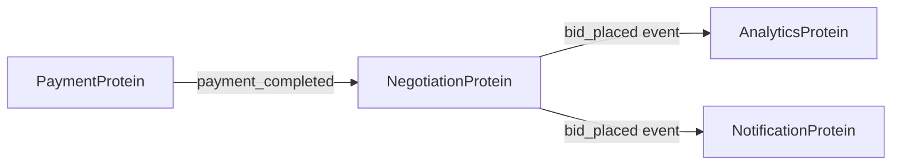

# Protein Mesh

The **Protein Mesh** is the distributed network of AI agents (Proteins) that process signals collaboratively. Each Protein implements ATCG-M protocols and communicates via the Binary Bloodstream.

## What is a Protein?

A Protein is a self-contained AI agent that:
- Implements one or more ATCG-M nucleotides
- Listens on specific NATS subjects
- Processes signals independently
- Emits events for coordination

## Protein Types

### Core Proteins
- **NegotiationProtein**: Bid/offer processing
- **NLUProtein**: Natural language understanding
- **SkillProtein**: External capability orchestration

### Support Proteins
- **AuthProtein**: Authentication/authorization
- **NotificationProtein**: Multi-channel messaging
- **AnalyticsProtein**: Event tracking and metrics

## Inter-Protein Communication

Proteins coordinate via events on the Binary Bloodstream:

## Next Steps

- Learn [ATCG-M protocols](atcg-metabolism)
- See [protocol implementations](../protocols/atcg-overview)
