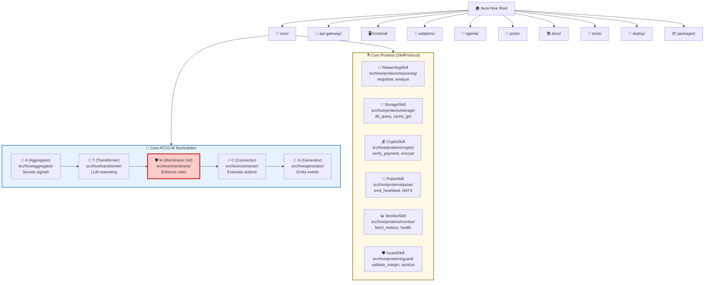

# Hive Geography: Sacred Chambers and Nucleotide Map

**Status:** AUTO-GENERATED by `tools/map_hive.py` — DO NOT EDIT MANUALLY

**Source of Truth:** `hive-manifest.yaml`

**Last Generated:** (Timestamp will be added by map_hive.py on each run)

---

## Hive Folder Hierarchy

This diagram shows the complete Hive geography:



---

## ATCG-M Nucleotide Locations

The **five nucleotides** of the ATCG-M metabolism pattern:

| Nucleotide | Role | Location | Implementation |
|------------|------|----------|----------------|
| **A (Aggregator)** | Senses signals | `core/src/hive/aggregator/` | Calls StorageSkill, MonitorSkill |
| **T (Transformer)** | LLM reasoning | `core/src/hive/transformer/` | Calls ReasoningSkill |
| **C (Connector)** | Executes actions | `core/src/hive/connector/` | Calls CryptoSkill, external APIs |
| **G (Generator)** | Emits events | `core/src/hive/generator/` | Calls PulseSkill for NATS |
| **M (Membrane)** | Immune system | `core/src/hive/membrane/` | Calls GuardSkill for validation |

**Critical Membrane Position:** M appears **twice** in metabolism flow:
- **M(in)** — Before Aggregator (validates inputs)
- **M(out)** — Between Transformer and Connector (enforces business rules)

---

## Protein Locations and Capabilities

All Proteins implement `SkillProtocol` (from `packages/aura-core/src/aura_core/dna.py`):

| Protein | Location | Capabilities | Settings Class |
|---------|----------|--------------|----------------|
| **ReasoningSkill** | `core/src/hive/proteins/reasoning/` | negotiate, analyze, generate_embedding | LLMSettings |
| **StorageSkill** | `core/src/hive/proteins/storage/` | db_query, db_write, vector_search, cache_get | DatabaseSettings |
| **CryptoSkill** | `core/src/hive/proteins/crypto/` | verify_payment, create_offer, encrypt_secret | CryptoSettings |
| **PulseSkill** | `core/src/hive/proteins/pulse/` | emit_heartbeat, schedule_deal | HeartbeatSettings |
| **MonitorSkill** | `core/src/hive/proteins/monitor/` | fetch_metrics, health_check, increment_counter | ServerSettings |
| **GuardSkill** | `core/src/hive/proteins/guard/` | validate_margin, validate_floor, sanitize_input | SafetySettings |

**Protein Principle:** Nucleotides (A, T, C, G, M) are **Pure Orchestrators**. Proteins are **Pure Implementors**.

---

## Sacred Chambers Table

| Path | Chamber Name | Role |
|------|--------------|------|
| `adapters` | **HiveExtensions** | External adapters |
| `agents` | **WorkerCells** | Autonomous agents |
| `agents/bee-keeper` | **KeeperCell** | Bee-keeper agent |
| `agents/bee-keeper/src/hive/` | **KeeperNucleus** | Custom chamber |
| `agents/bee-keeper/src/hive/connector/proteins` | **KeeperSecurityCitadel** | Custom chamber |
| `api-gateway` | **HiveGate** | HTTP/JSON API gateway |
| `components` | **SpecializedProteins** | Skill implementations |
| `core/migrations` | **HiveEvolutionaryScrolls** | Custom chamber |
| `core/scripts` | **WorkerDirectives** | Utility scripts and orchestration |
| `core/src/config` | **SacredCodex** | Configuration and settings |
| `core/src/hive/aggregator` | **SensoryNexus** | Signal aggregation |
| `core/src/hive/aggregator/db.py` | **AuthorizedEnzyme** | Allowed implementation file |
| `core/src/hive/aggregator/embeddings.py` | **AuthorizedEnzyme** | Allowed implementation file |
| `core/src/hive/aggregator/main.py` | **AuthorizedEnzyme** | Allowed implementation file |
| `core/src/hive/aggregator/vitals.py` | **AuthorizedEnzyme** | Allowed implementation file |
| `core/src/hive/connector/__init__.py` | **AuthorizedEnzyme** | Allowed implementation file |
| `core/src/hive/connector/proteins` | **SecurityCitadel** | Cryptographic operations |
| `core/src/hive/generator` | **NeuralPulse** | Event emission |
| `core/src/hive/generator/__init__.py` | **AuthorizedEnzyme** | Allowed implementation file |
| `core/src/hive/membrane` | **HiveMembrane** | Input/output validation guards |
| `core/src/hive/metabolism` | **MetabolicEngine** | ATCG-M orchestration |
| `core/src/hive/services` | **WorkerDirectives** | Utility scripts and orchestration |
| `core/src/hive/services/market.py` | **AuthorizedEnzyme** | Allowed implementation file |
| `core/src/hive/transformer` | **ReasoningNucleus** | LLM reasoning engine |
| `core/src/hive/transformer/__init__.py` | **AuthorizedEnzyme** | Allowed implementation file |
| `core/tests` | **ValidationPollen** | Unit and integration tests |
| `deploy` | **HiveArmor** | Kubernetes/Docker deployments |
| `docs` | **ChroniclersArchive** | Documentation |
| `frontend` | **HiveWindow** | User interface |
| `packages` | **SharedNucleotides** | Shared libraries |
| `proto` | **SacredScrolls** | Protobuf definitions |
| `tests` | **OuterValidationPollen** | Root-level tests |
| `tools` | **ToolShed** | Development utilities |

---

## Regeneration Instructions

To regenerate this file after modifying `hive-manifest.yaml`:

```bash
python tools/map_hive.py
```

**Options:**
- `--manifest PATH` — Custom manifest path (default: `hive-manifest.yaml`)
- `--output PATH` — Custom output path (default: `docs/visual/hive/geography.md`)
- `--format markdown|mermaid` — Output format (default: markdown)

---

*For the glory of the Hive. 🐝*
