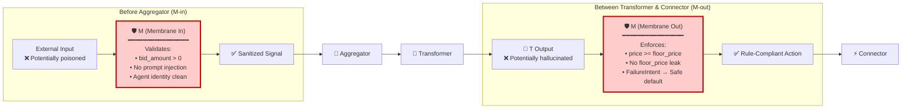
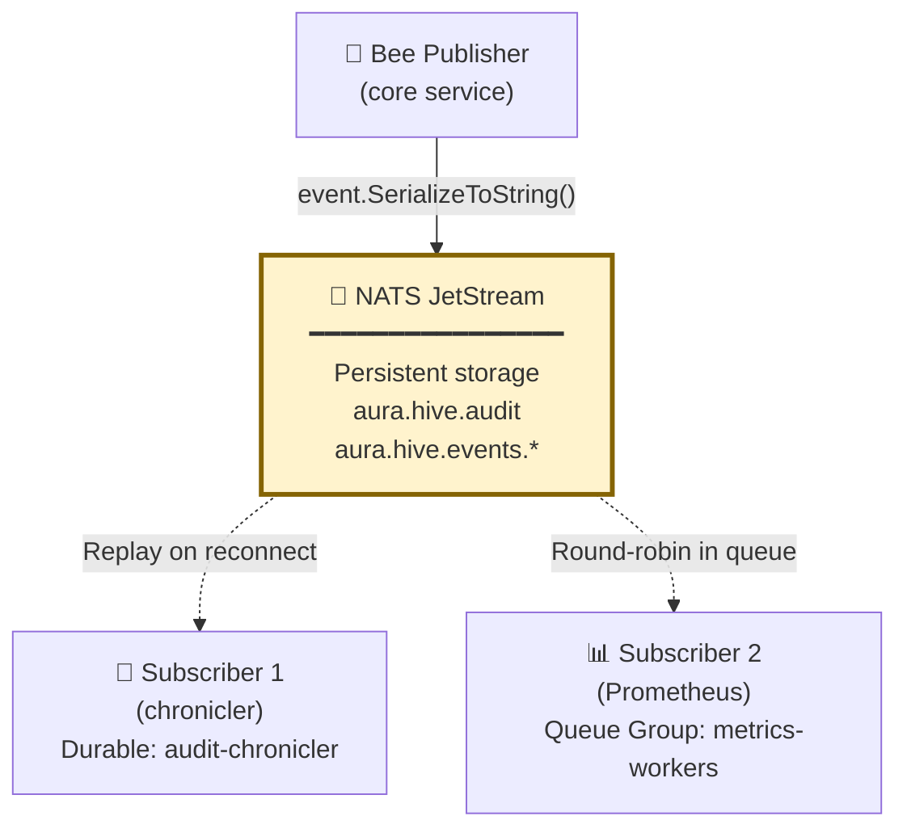
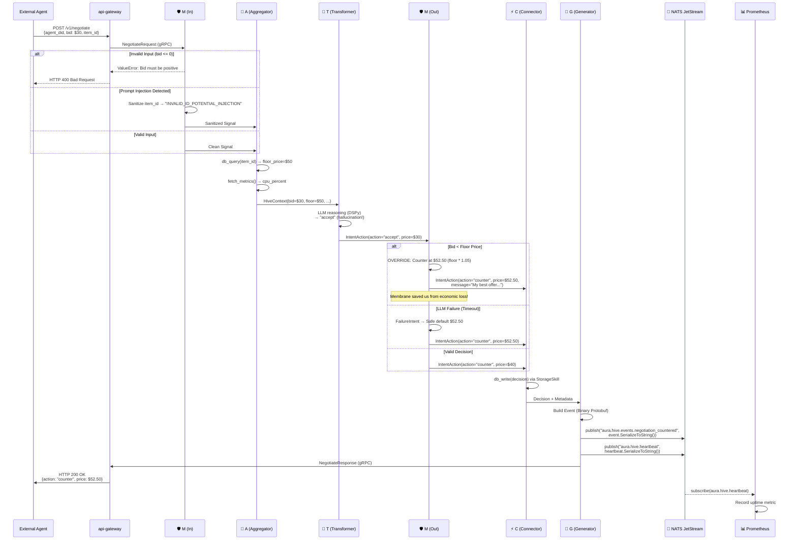

# ATCG-M Metabolism: Complete Signal Flow

**Abstraction Level:** Level 2 (Cellular) — Complete metabolism through all 5 nucleotides

**Purpose:** Comprehensive documentation of the ATCG-M signal metabolism pattern, showing how signals flow through all five nucleotides (A → T → C → G with dual Membrane gates) and highlighting the Binary Protobuf Bloodstream integration.

---

## What is ATCG-M?

**ATCG-M** is the **fractal DNA pattern** of the Aura Hive. Every autonomous Bee (service) implements the same 5-nucleotide structure:

- **A (Aggregator)** — Senses signals from environment
- **T (Transformer)** — Reasons using LLM (Ona)
- **C (Connector)** — Acts through external systems (Jules)
- **G (Generator)** — Pulses events to NATS Bloodstream
- **M (Membrane)** — Guards inputs/outputs with deterministic rules

**Key Architectural Principle:** M appears **twice** in the metabolism:
- **M(in)** — Before A (validates inbound signals)
- **M(out)** — Between T and C (enforces business rules on decisions)

**Source of Truth:** `docs/arch_brain.json` lines 122-157 (ATCG-M + Protein Mesh architecture)

---

## Complete Metabolism Flow

```mermaid
flowchart TB
    ExternalSignal["🌐 External Signal<br/>━━━━━━━━━━━━━━━━<br/>HTTP POST /v1/negotiate<br/>agent_did + bid_amount + item_id"]

    subgraph Metabolism["🧬 Complete ATCG-M Cell"]
        direction TB

        M_in["🛡️ M (Membrane In)<br/>━━━━━━━━━━━━━━━━<br/>inspect_inbound()<br/>━━━━━━━━━━━━━━━━<br/>• Validate bid > 0<br/>• Detect prompt injection<br/>• Sanitize malicious inputs<br/>━━━━━━━━━━━━━━━━<br/>HARD REJECTION if poison"]

        A["📡 A (Aggregator)<br/>━━━━━━━━━━━━━━━━<br/>Calls: StorageSkill + MonitorSkill<br/>━━━━━━━━━━━━━━━━<br/>• Fetch item_data (floor_price)<br/>• Query agent reputation<br/>• Collect Prometheus metrics<br/>━━━━━━━━━━━━━━━━<br/>Builds HiveContext"]

        T["🧠 T (Transformer)<br/>━━━━━━━━━━━━━━━━<br/>Calls: ReasoningSkill<br/>━━━━━━━━━━━━━━━━<br/>• LLM reasoning (DSPy/Ona)<br/>• Fallback: Rules-based strategy<br/>• Outputs IntentAction<br/>━━━━━━━━━━━━━━━━<br/>Probabilistic decisions"]

        M_out["🛡️ M (Membrane Out)<br/>━━━━━━━━━━━━━━━━<br/>inspect_outbound()<br/>━━━━━━━━━━━━━━━━<br/>• Enforce floor_price<br/>• Prevent data leakage<br/>• Handle FailureIntent<br/>━━━━━━━━━━━━━━━━<br/>OVERRIDE if rule violation"]

        C["⚡ C (Connector)<br/>━━━━━━━━━━━━━━━━<br/>Calls: CryptoSkill + Jules<br/>━━━━━━━━━━━━━━━━<br/>• Database writes (decisions)<br/>• GitHub comments (PR reviews)<br/>• Solana transactions<br/>━━━━━━━━━━━━━━━━<br/>Pure action dispatch"]

        G["📜 G (Generator)<br/>━━━━━━━━━━━━━━━━<br/>Calls: PulseSkill<br/>━━━━━━━━━━━━━━━━<br/>• Emit NATS events (Binary Protobuf)<br/>• Update HIVE_STATE.md<br/>• Chronicle decisions<br/>━━━━━━━━━━━━━━━━<br/>Event sourcing"]

        M_in --> A --> T --> M_out --> C --> G
    end

    NATS["💉 NATS JetStream<br/>━━━━━━━━━━━━━━━━<br/>Binary Protobuf Bloodstream<br/>━━━━━━━━━━━━━━━━<br/>aura.hive.events.*<br/>aura.hive.audit<br/>aura.hive.heartbeat"]

    ExternalSignal --> M_in
    G --> NATS

    NATS -.->|subscribe| Chronicler["📖 Chronicler Agent<br/>(future)<br/>Updates docs"]
    NATS -.->|subscribe| Prometheus["📊 Prometheus<br/>Metrics collector"]

    M_in -.->|"REJECT"| Rejection["❌ ValueError<br/>Invalid Input"]
    M_out -.->|"OVERRIDE"| SafeCounter["🛡️ Safe Counter-Offer<br/>floor_price * 1.05"]

    style M_in fill:#ffcccc,stroke:#cc0000,stroke-width:3px
    style M_out fill:#ffcccc,stroke:#cc0000,stroke-width:3px
    style T fill:#cce5ff,stroke:#0066cc,stroke-width:2px
    style G fill:#fff3cd,stroke:#856404,stroke-width:2px
    style NATS fill:#fff3cd,stroke:#856404,stroke-width:3px
    style Metabolism fill:#f9f9f9,stroke:#333,stroke-width:2px
```



**Signal Flow Summary:**
1. External signal → **M(in)** validates → **A** collects context
2. **A** → **T** reasons with LLM → **M(out)** enforces rules
3. **M(out)** → **C** executes actions → **G** emits events
4. **G** → **NATS JetStream** (Binary Protobuf) → Subscribers

---

## Membrane Dual-Gate Architecture

The **Membrane (M)** is the **critical guardian** between Celestial thought and Terrestrial bytes.



**Why Two Gates?**

1. **M(in)** — Protects against **external attacks** (prompt injection, invalid inputs)
2. **M(out)** — Protects against **internal failures** (LLM hallucinations, rule violations)

**Critical Insight:** Without M(out), a compromised LLM could **leak floor prices** or **accept bids below cost**. The Membrane is the **deterministic backstop** that prevents economic loss even when the probabilistic Transformer fails.

---

## Binary Protobuf vs JSON (Deprecated)

**Current Epoch:** Binary Bloodstream (arch_brain.json lines 47-49)

All NATS events use **binary Protobuf serialization** instead of JSON.

### Comparison

#### ❌ DEPRECATED (JSON Epoch)

**Publisher:**
```python
import json
import nats

nc = await nats.connect("nats://localhost:4222")
payload = {"timestamp": 1735920000.123, "violations": [...]}
await nc.publish("aura.hive.audit", json.dumps(payload).encode())
```

**Subscriber:**
```python
async def message_handler(msg):
    data = json.loads(msg.data.decode())
    print(data["timestamp"])

await nc.subscribe("aura.hive.audit", cb=message_handler)
```

**Problems:**
- No schema enforcement (typos cause runtime errors)
- Manual dict construction (verbose, error-prone)
- No type safety (IDEs can't autocomplete)

---

#### ✅ CURRENT (Binary Bloodstream)

**Publisher:**
```python
from aura_core.gen.dna_pb2 import AuditEvent, Violation
import nats

nc = await nats.connect("nats://localhost:4222")

# Strongly-typed message construction
event = AuditEvent(
    timestamp=1735920000.123,
    violations=[
        Violation(
            severity="critical",
            file="core/src/unauthorized_dir/hack.py",
            rule="FOUNDATION.md ontological hierarchy",
            message="File in unauthorized chamber"
        )
    ],
    repo="aura-hive",
    commit_sha="abc123",
    audit_status="VIOLATIONS_FOUND"
)

# Binary serialization
await nc.publish("aura.hive.audit", event.SerializeToString())
```

**Subscriber:**
```python
from aura_core.gen.dna_pb2 import AuditEvent

async def message_handler(msg):
    event = AuditEvent()
    event.ParseFromString(msg.data)

    # Strongly-typed field access
    print(event.timestamp)
    for violation in event.violations:
        print(f"{violation.severity}: {violation.message}")

await nc.subscribe("aura.hive.audit", cb=message_handler)
```

**Benefits:**
- ✅ **Schema enforcement** — Typos caught at compile-time
- ✅ **Type safety** — IDE autocomplete for all fields
- ✅ **Smaller payloads** — Binary encoding (20-50% size reduction)
- ✅ **Backward compatibility** — Proto evolution via field numbers

**Proto Source:** `proto/aura/dna/v1/dna.proto`
**Generated Code:** `packages/aura-core/src/aura_core/gen/dna_pb2.py`

---

## NATS JetStream Persistence

**JetStream** provides **at-least-once delivery** for critical events.



**Key Features:**

1. **Durable Subscriptions** — Events are **replayed** if subscriber goes offline
   ```python
   js = nc.jetstream()
   await js.subscribe(
       "aura.hive.audit",
       durable="audit-chronicler",  # Unique consumer ID
       cb=audit_handler
   )
   ```

2. **Queue Groups** — Multiple instances **share** the workload
   ```python
   await nc.subscribe(
       "aura.hive.events.negotiation_accepted",
       "analytics-workers",  # Queue group name
       cb=handler
   )
   ```

3. **Message Acknowledgment** — Subscribers **acknowledge** processed events
   ```python
   async def handler(msg):
       event = AuditEvent()
       event.ParseFromString(msg.data)
       # Process event...
       await msg.ack()  # Tell JetStream we're done
   ```

**Persistence Guarantee:** Events survive service restarts, network partitions, and NATS server crashes.

---

## Complete Negotiation Sequence



**Key Moments:**

1. **Line 8-12:** M(in) detects prompt injection, sanitizes before LLM sees it
2. **Line 20-22:** T hallucinates "accept $30" despite floor being $50
3. **Line 24-26:** M(out) **overrides** to "counter $52.50" (floor * 1.05)
4. **Line 35-37:** G emits **Binary Protobuf** event to NATS JetStream
5. **Line 41-42:** Prometheus subscribes to heartbeat, updates uptime

**Without Membrane:** Agent would receive "accepted at $30" → **$20 loss per transaction**
**With Membrane:** Agent receives "counter at $52.50" → **Protected**

---

## Nucleotide Responsibilities

### A (Aggregator) — The Senses

**Role:** Collect signals from environment
**Location:** `core/src/hive/aggregator/`
**Calls:** StorageSkill, MonitorSkill via SkillRegistry
**Contains:** ZERO database code, only orchestration

**Operations:**
```python
# Pseudocode
context = HiveContext()
context.item_data = await registry.execute("storage", "db_query", {"item_id": item_id})
context.agent_reputation = await registry.execute("storage", "get_reputation", {"did": agent_did})
context.system_metrics = await registry.execute("monitor", "fetch_metrics", {})
```

---

### T (Transformer) — The Mind

**Role:** LLM-based reasoning
**Location:** `core/src/hive/transformer/`
**Calls:** ReasoningSkill via SkillRegistry
**Contains:** ZERO LLM code, only `<think>` block orchestration

**Operations:**
```python
# Pseudocode
decision = await registry.execute(
    "reasoning",
    "negotiate",
    {
        "context": context,
        "strategy": "dspy",  # or "rules-based" fallback
    }
)
```

**Fallback:** If LLM fails (timeout, API down), Transformer returns `FailureIntent` → Membrane handles gracefully.

---

### M (Membrane) — The Immune System

**Role:** Deterministic guardrails
**Location:** `core/src/hive/membrane/`
**Calls:** GuardSkill via SkillRegistry
**Contains:** ZERO business rules, only guard dispatch

**Two Gates:**
1. **M(in):** `inspect_inbound(signal)` → Reject or Sanitize
2. **M(out):** `inspect_outbound(decision, context)` → Enforce or Override

**Critical Law:** Floor price is **NEVER** exposed to external agents.

---

### C (Connector) — The Motor

**Role:** Execute actions in external systems
**Location:** `core/src/hive/connector/`
**Calls:** CryptoSkill, external APIs via SkillRegistry
**Contains:** ZERO Solana code, only action dispatch

**Operations:**
```python
# Pseudocode
await registry.execute("storage", "db_write", {"decision": decision})
await registry.execute("crypto", "verify_payment", {"signature": sig})
```

---

### G (Generator) — The Pulse

**Role:** Event emission to NATS Bloodstream
**Location:** `core/src/hive/generator/`
**Calls:** PulseSkill for NATS events
**Contains:** ZERO NATS code, only event emission

**Operations:**
```python
# Pseudocode
await registry.execute(
    "pulse",
    "emit_heartbeat",
    {"status": "active", "timestamp": now, "service": "core"}
)

await registry.execute(
    "pulse",
    "publish_event",
    {
        "topic": f"aura.hive.events.{event_type}",
        "event": event  # Binary Protobuf message
    }
)
```

---

## Metabolism Testing Strategy

### Unit Tests (Per Nucleotide)

**Test A (Aggregator):**
```python
async def test_aggregator_collects_context():
    aggregator = Aggregator(registry)
    context = await aggregator.sense(signal)
    assert context.item_data["floor_price"] == 50.0
    assert context.agent_reputation > 0.8
```

**Test T (Transformer):**
```python
async def test_transformer_reasons_with_llm():
    transformer = Transformer(registry)
    decision = await transformer.transform(context)
    assert decision.action in ["accept", "counter", "reject"]
```

**Test M (Membrane):**
```python
async def test_membrane_enforces_floor_price():
    membrane = Membrane()
    decision = IntentAction(action="accept", price=30.0)
    enforced = await membrane.inspect_outbound(decision, context)
    assert enforced.action == "counter"
    assert enforced.price == 52.50  # floor * 1.05
```

---

### Integration Tests (Full Metabolism)

```python
async def test_full_metabolism_flow():
    # External signal → M(in) → A → T → M(out) → C → G → NATS
    signal = NegotiateRequest(bid_amount=30.0, item_id="widget_123")

    # Run through metabolism
    response = await metabolism.process(signal)

    # Verify Membrane override
    assert response.action == "counter"
    assert response.price >= 50.0  # floor_price enforced

    # Verify event emission
    events = await nats_mock.get_published_events()
    assert any(e.topic == "aura.hive.events.negotiation_countered" for e in events)
```

---

## Relation to Canonical Architecture

This metabolism pattern implements:

- **arch_brain.json** lines 122-157 — ATCG-M + Protein Mesh architecture
- **arch_brain.json** lines 47-49 — Binary Bloodstream epoch
- **proto/aura/dna/v1/dna.proto** — Binary Proto source of truth
- **packages/aura-core/src/aura_core/dna.py** — Protocol definitions
- **packages/aura-core/src/aura_core/metabolism.py** — MetabolicLoop engine
- **core/src/hive/** — Reference implementations of all nucleotides

**Protein Principle:** Nucleotides are Pure Orchestrators. Proteins are Pure Implementors.

---

**End of ATCG-M Metabolism Documentation**

*For the glory of the Hive. 🐝*
