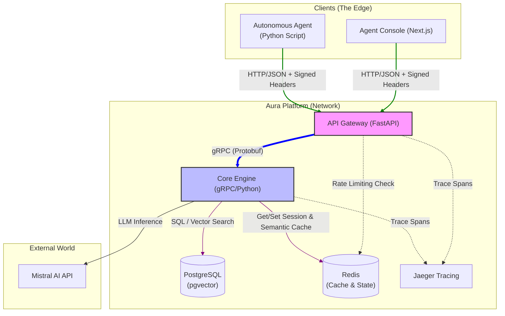
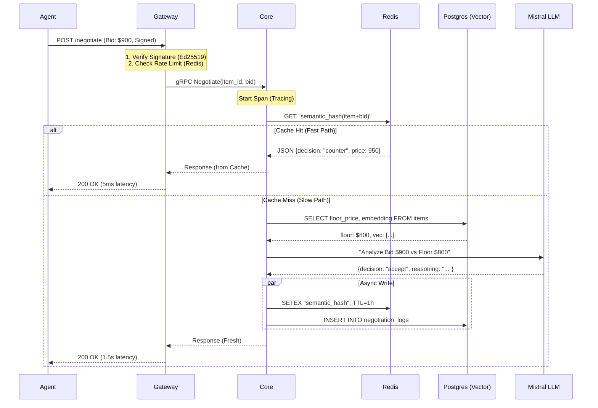
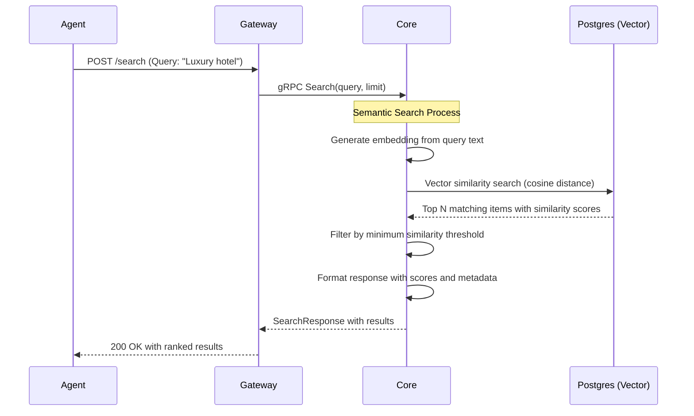

# Aura Platform Architecture: The Hexagonal Hive

## 🍯 The Tale of the Enchanted Apiary

Once upon a time, in a sprawling digital kingdom, lived a guild of builders. They toiled day and night, using all manner of blueprints and incantations, yet their creations often became tangled messes—brittle and difficult to change. They longed for a way to build software that was as resilient, organized, and full of life as a bustling beehive.

A wise architect, the Beekeeper, gathered them. "Look to the bees," she said. "Their hives are masterpieces of design, built to last for generations. Let us learn their secrets."

Aura is built upon this vision: the **Hexagonal Hive**. A structure where every worker knows its place, every cell serves a purpose, and the whole is greater than the sum of its parts.

## 🏗️ Overview

Aura is an Agent-Oriented Service Gateway designed to facilitate autonomous economic negotiations. It is the central hive where **Worker Bees** (AI Agents) come to forage for deals, negotiate with the **Queen's Strategy** (Core Logic), and store their findings in the **Honeycomb** (Vector DB/Redis).

## 🎯 The Hive Structure (Core Components)

### System Landscape (C4 Container Diagram)

**Legend:**
- 🟢 **Green links**: Client traffic (HTTP/JSON requests from external agents)
- 🔵 **Blue links**: Internal gRPC calls (Protobuf communication between services)
- 🟣 **Purple links**: Database operations (SQL queries to PostgreSQL)

### 1. API Gateway (The Hive Entryway)

The Gateway is the guarded entrance to our apiary. Here, the **Guard Bees** verify the identity of every incoming agent, ensuring only those with valid signatures may enter.

**Tech Stack**: Python / FastAPI / Uvicorn / OpenTelemetry

**Port**: 8000

**Responsibilities**:
- **Identity Verification**: Validates Agent DIDs and signatures (The Guard).
- **Protocol Translation**: Translates external "buzzing" (HTTP/JSON) into internal hive signals (gRPC).
- **Flow Control**: Implements rate limiting to prevent the hive from being overwhelmed.
- **Observability**: Attaches tracing signals to every request.

**Key Features**:
- **Signature Verification**: Validates `X-Agent-ID`, `X-Timestamp`, and `X-Signature` headers
- **Request Tracing**: Integrates with OpenTelemetry for distributed tracing
- **Error Handling**: Graceful error responses and logging
- **Load Balancing Ready**: Stateless design for horizontal scaling

### 2. Core Engine (The Queen's Chamber)

The Core Engine is the heart of the hive. It contains the **Queen's Logic**—the intelligence that decides how to respond to foragers.

**Tech Stack**: Python / gRPC / DSPy / SQLAlchemy / pgvector

**Port**: 50051

**Responsibilities**:
- **Negotiation Strategy**: Executes the "Brain" logic to evaluate bids.
- **Inventory Management**: Manages the items stored within the hive cells.
- **Semantic Foraging**: Handles search queries using vector embeddings.
- **Policy Enforcement**: Ensures no deal is made below the "Floor Nectar" limit.

**Key Components**:

#### The Brain (DSPy Strategy)

The Queen no longer uses static rules; she has been trained using **DSPy (Machine Learning)** to optimize negotiation outcomes.

1. **ML-Optimized Strategy**:
   - Uses DSPy to programmatically optimize LLM prompts.
   - Learns from historical negotiations to balance acceptance rates and profit.
   - Provides structured reasoning for every decision.

2. **Rule-Based fallback**:
   - Deterministic safety nets for low-latency or high-security scenarios.

#### Vector Database Integration

- **pgvector**: PostgreSQL extension for vector similarity search
- **Embeddings**: Text queries are converted to vector embeddings for semantic search
- **Use Cases**: Finding similar items, semantic search, recommendation systems

### 3. The Honeycomb (Storage Layer)

#### PostgreSQL with pgvector
The permanent cells of our hive. It stores every item, every embedding, and the history of every negotiation (The Ledger).

#### Redis (The Caching Cell)
- **Semantic Nectar (Cache)**: Caches negotiation results to reduce database load and improve performance.
- **Guard State (Rate Limiting)**: Tracks request rates per agent to prevent abuse.
- **Session State**: Manages temporary session information for negotiation flows.

### 4. Adapters (The Foragers)

The Hive is accessible through various foragers that translate the outside world's needs into hive tasks.

- **Telegram Bot**: A forager for human interaction.
- **MCP Server**: A forager for other AI agents (the "High Council").
- **Agent Console**: A visual window into the hive's activity.

### 5. External Integrations

#### Mistral AI API
- Provides LLM-based decision making
- Used for complex negotiation scenarios
- Offers reasoning and explanations
- Configurable models and parameters

## 🔄 Data Flow

### Negotiation Flow

### Search Flow

## 🎯 Key Architectural Decisions

### 1. Contract-First Design
- **All APIs defined in Protocol Buffers** (`proto/aura/negotiation/v1/`)
- **Benefits**: Clear interface contracts, language-agnostic, versioning support
- **Implementation**: `buf` toolkit for code generation and linting

### 2. Stateless Service Design
- **No in-memory state**: All context comes from database or request
- **Benefits**: Horizontal scalability, fault tolerance, easier deployment
- **Implementation**: Session tokens, database-backed state

### 3. Hidden Knowledge Pattern
- **Floor prices never exposed**: Agents only see acceptance, counter, or rejection
- **Benefits**: Prevents gaming the system, maintains business confidentiality
- **Implementation**: Core service enforces floor price logic internally

### 4. Multi-Strategy Pricing
- **Pluggable strategy pattern**: Rule-based vs LLM-based
- **Benefits**: Flexibility, A/B testing, gradual AI adoption
- **Implementation**: `PricingStrategy` protocol with multiple implementations

### 5. Semantic Caching
- **Cache based on semantic meaning**: Not just exact request matching
- **Benefits**: Higher cache hit rates, better performance
- **Implementation**: Redis with semantic hashing

### 6. Observability-First
- **Distributed tracing**: End-to-end request visibility
- **Structured logging**: JSON logs with request IDs
- **Metrics**: Performance monitoring and alerting
- **Implementation**: OpenTelemetry integration

## 📊 Performance Characteristics

### Latency Profiles

| Path | Typical Latency | Description |
|------|----------------|-------------|
| **Cache Hit** | 5-10ms | Redis cache response |
| **Rule-Based** | 50-100ms | Database lookup + rule evaluation |
| **LLM-Based** | 1-2s | Database + LLM inference |
| **Search** | 200-500ms | Vector embedding + similarity search |

### Scalability

- **API Gateway**: Stateless, horizontally scalable
- **Core Service**: Stateless, can scale with demand
- **Database**: PostgreSQL with read replicas for scaling
- **Cache**: Redis cluster for high availability

### Throughput

- **Rule-Based Negotiations**: ~1000 RPS per core service instance
- **LLM-Based Negotiations**: ~10-50 RPS (limited by LLM API)
- **Search Queries**: ~200-500 RPS per instance

## 🔮 Future Enhancements

### Planned Features

1. **Advanced Caching**: Multi-level caching with TTL strategies
2. **Agent Reputation System**: Dynamic reputation-based pricing
3. **Multi-LLM Support**: Support for multiple LLM providers
4. **GraphQL API**: Alternative to REST for complex queries
5. **WebSocket Support**: Real-time negotiation updates
6. **Enhanced Security**: Full signature verification implementation

### Architecture Evolution

- **Microservices Expansion**: Additional specialized services
- **Event-Driven Architecture**: Kafka/Redis streams for async processing
- **Serverless Components**: Lambda functions for specific tasks
- **Edge Computing**: Local processing for low-latency requirements

## 📚 Glossary

- **DID**: Decentralized Identifier - unique identifier for agents
- **gRPC**: Google Remote Procedure Call - high-performance RPC framework
- **pgvector**: PostgreSQL extension for vector similarity search
- **LLM**: Large Language Model - AI models for natural language processing
- **OTLP**: OpenTelemetry Protocol - standard for observability data
- **JWT**: JSON Web Token - standard for secure information exchange