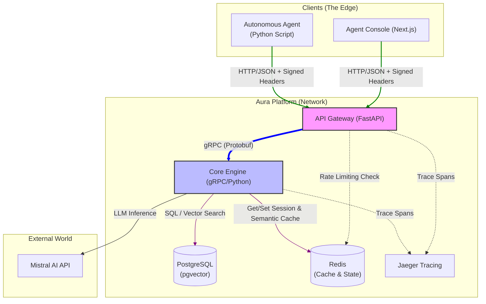
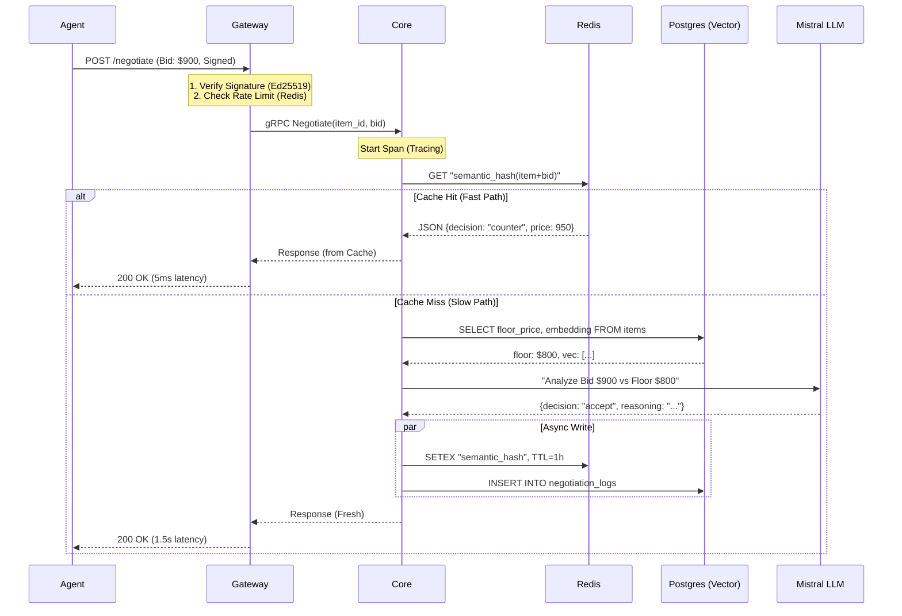
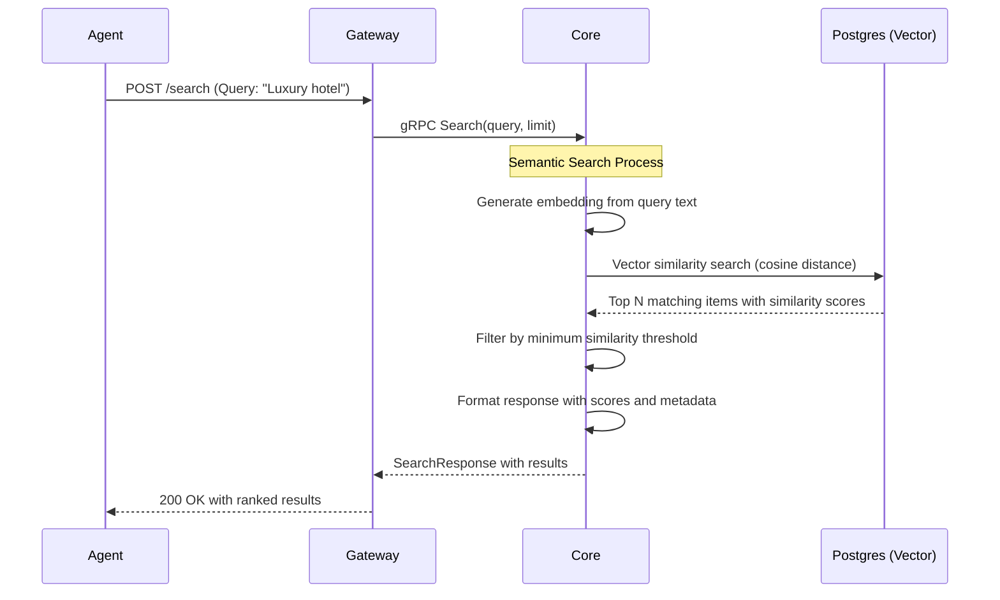

# Aura Platform Architecture

## 🏗️ Overview

Aura is an Agent-Oriented Service Gateway designed to facilitate autonomous economic negotiations between AI agents and service providers. The platform enables AI agents to negotiate prices, search for items using semantic search, and interact with human-in-the-loop workflows when required.

## 🎯 Core Components

### System Landscape (C4 Container Diagram)

**Legend:**
- 🟢 **Green links**: Client traffic (HTTP/JSON requests from external agents)
- 🔵 **Blue links**: Internal gRPC calls (Protobuf communication between services)
- 🟣 **Purple links**: Database operations (SQL queries to PostgreSQL)

### 1. API Gateway (The Diplomat)

**Tech Stack**: Python / FastAPI / Uvicorn / OpenTelemetry

**Port**: 8000

**Responsibilities**:
- Validates Agent Identity using DID (Decentralized Identifier) tokens
- Translates HTTP/JSON requests to internal gRPC calls using Protocol Buffers
- Implements rate limiting to prevent abuse
- Handles request authentication and signature verification
- Provides RESTful API endpoints for external agents

**Key Features**:
- **Signature Verification**: Validates `X-Agent-ID`, `X-Timestamp`, and `X-Signature` headers
- **Request Tracing**: Integrates with OpenTelemetry for distributed tracing
- **Error Handling**: Graceful error responses and logging
- **Load Balancing Ready**: Stateless design for horizontal scaling

### 2. Core Engine (The Brain)

**Tech Stack**: Python / gRPC / LangChain / SQLAlchemy / pgvector

**Port**: 50051

**Responsibilities**:
- Manages inventory items and negotiation sessions
- Executes pricing strategies (Rule-based or LLM-based)
- Enforces business logic and floor price constraints
- Handles semantic search using vector embeddings
- Manages session state and caching

**Key Components**:

#### Pricing Strategy System

Aura supports multiple pricing strategies:

1. **Rule-Based Strategy**:
   - Simple, deterministic decision making
   - Rules: `bid < floor_price` → Counter, `bid >= floor_price` → Accept
   - High performance, low latency
   - No external dependencies

2. **LLM-Based Strategy (Mistral)**:
   - Uses Mistral AI for intelligent negotiation decisions
   - Considers market conditions, agent reputation, and business goals
   - Provides reasoning and explanations for decisions
   - Supports complex negotiation scenarios

#### Vector Database Integration

- **pgvector**: PostgreSQL extension for vector similarity search
- **Embeddings**: Text queries are converted to vector embeddings for semantic search
- **Use Cases**: Finding similar items, semantic search, recommendation systems

### 3. Storage Layer

#### PostgreSQL with pgvector
- Stores inventory items with vector embeddings
- Manages negotiation sessions and logs
- Provides transactional integrity
- Supports complex queries and joins

#### Redis
- **Semantic Cache**: Caches negotiation results based on semantic hashes
- **Rate Limiting**: Tracks request rates per agent
- **Session Management**: Temporary session storage
- **Performance Optimization**: Reduces database load

### 4. External Integrations

#### Mistral AI API
- Provides LLM-based decision making
- Used for complex negotiation scenarios
- Offers reasoning and explanations
- Configurable models and parameters

## 🔄 Data Flow

### Negotiation Flow

### Search Flow

## 🎯 Key Architectural Decisions

### 1. Contract-First Design
- **All APIs defined in Protocol Buffers** (`proto/aura/negotiation/v1/`)
- **Benefits**: Clear interface contracts, language-agnostic, versioning support
- **Implementation**: `buf` toolkit for code generation and linting

### 2. Stateless Service Design
- **No in-memory state**: All context comes from database or request
- **Benefits**: Horizontal scalability, fault tolerance, easier deployment
- **Implementation**: Session tokens, database-backed state

### 3. Hidden Knowledge Pattern
- **Floor prices never exposed**: Agents only see acceptance, counter, or rejection
- **Benefits**: Prevents gaming the system, maintains business confidentiality
- **Implementation**: Core service enforces floor price logic internally

### 4. Multi-Strategy Pricing
- **Pluggable strategy pattern**: Rule-based vs LLM-based
- **Benefits**: Flexibility, A/B testing, gradual AI adoption
- **Implementation**: `PricingStrategy` protocol with multiple implementations

### 5. Semantic Caching
- **Cache based on semantic meaning**: Not just exact request matching
- **Benefits**: Higher cache hit rates, better performance
- **Implementation**: Redis with semantic hashing

### 6. Observability-First
- **Distributed tracing**: End-to-end request visibility
- **Structured logging**: JSON logs with request IDs
- **Metrics**: Performance monitoring and alerting
- **Implementation**: OpenTelemetry integration

## 📊 Performance Characteristics

### Latency Profiles

| Path | Typical Latency | Description |
|------|----------------|-------------|
| **Cache Hit** | 5-10ms | Redis cache response |
| **Rule-Based** | 50-100ms | Database lookup + rule evaluation |
| **LLM-Based** | 1-2s | Database + LLM inference |
| **Search** | 200-500ms | Vector embedding + similarity search |

### Scalability

- **API Gateway**: Stateless, horizontally scalable
- **Core Service**: Stateless, can scale with demand
- **Database**: PostgreSQL with read replicas for scaling
- **Cache**: Redis cluster for high availability

### Throughput

- **Rule-Based Negotiations**: ~1000 RPS per core service instance
- **LLM-Based Negotiations**: ~10-50 RPS (limited by LLM API)
- **Search Queries**: ~200-500 RPS per instance

## 🔮 Future Enhancements

### Planned Features

1. **Advanced Caching**: Multi-level caching with TTL strategies
2. **Agent Reputation System**: Dynamic reputation-based pricing
3. **Multi-LLM Support**: Support for multiple LLM providers
4. **GraphQL API**: Alternative to REST for complex queries
5. **WebSocket Support**: Real-time negotiation updates
6. **Enhanced Security**: Full signature verification implementation

### Architecture Evolution

- **Microservices Expansion**: Additional specialized services
- **Event-Driven Architecture**: Kafka/Redis streams for async processing
- **Serverless Components**: Lambda functions for specific tasks
- **Edge Computing**: Local processing for low-latency requirements

## 📚 Glossary

- **DID**: Decentralized Identifier - unique identifier for agents
- **gRPC**: Google Remote Procedure Call - high-performance RPC framework
- **pgvector**: PostgreSQL extension for vector similarity search
- **LLM**: Large Language Model - AI models for natural language processing
- **OTLP**: OpenTelemetry Protocol - standard for observability data
- **JWT**: JSON Web Token - standard for secure information exchange