# Sacred Chambers Map: Poetic Directory Roles

**Abstraction Level:** Level 1 (Organism) — Repository directory structure

**Purpose:** Visualize the `ALLOWED_CHAMBERS` from `dna.py` lines 50-75, showing how filesystem organization follows the bio-organic folklore aesthetic with poetic chamber names.

---

## What Are Sacred Chambers?

**Sacred Chambers** are specially designated directories with **poetic metaphorical names** that communicate their architectural role. Defined in `packages/aura-core/src/aura_core/dna.py:50-75`, these chambers are enforced by the **bee-keeper** auditor to prevent architectural drift.

Each chamber has:
- A **filesystem path** (e.g., `core-service/migrations`)
- A **sacred name** (e.g., "HiveEvolutionaryScrolls")
- An **ontological role** (Genome, Nucleus, Organs, or Citizens)

---

## The Complete Sacred Chambers Map

```mermaid
flowchart TB
    subgraph Genome["🧬 GENOME LAYER"]
        SharedNucleotides["packages/<br/>━━━━━━━━━━━━━━━━<br/>SharedNucleotides<br/>━━━━━━━━━━━━━━━━<br/>Immutable Protocols"]
    end

    subgraph Nucleus["🧠 NUCLEUS LAYER (core-service/)"]
        direction TB
        EvolutionaryScrolls["migrations/<br/>━━━━━━━━━━━━━━━━<br/>HiveEvolutionaryScrolls<br/>━━━━━━━━━━━━━━━━<br/>Database migrations"]
        ValidationPollen["tests/<br/>━━━━━━━━━━━━━━━━<br/>ValidationPollen<br/>━━━━━━━━━━━━━━━━<br/>Test suites"]
        AutomationScrolls["scripts/<br/>━━━━━━━━━━━━━━━━<br/>HiveAutomationScrolls<br/>━━━━━━━━━━━━━━━━<br/>Automation scripts"]
        HiveMemory["data/<br/>━━━━━━━━━━━━━━━━<br/>HiveMemory<br/>━━━━━━━━━━━━━━━━<br/>Persistent data"]
        SacredCodex["src/config/<br/>━━━━━━━━━━━━━━━━<br/>SacredCodex<br/>━━━━━━━━━━━━━━━━<br/>Configuration"]
        WorkerDirectives["src/services/<br/>━━━━━━━━━━━━━━━━<br/>WorkerDirectives<br/>━━━━━━━━━━━━━━━━<br/>Service logic"]
        ReasoningNucleus["src/llm/<br/>━━━━━━━━━━━━━━━━<br/>ReasoningNucleus<br/>━━━━━━━━━━━━━━━━<br/>LLM strategies"]
        SecurityCitadel["src/crypto/<br/>━━━━━━━━━━━━━━━━<br/>SecurityCitadel<br/>━━━━━━━━━━━━━━━━<br/>Cryptography"]
        EchoChamber["src/prompts/<br/>━━━━━━━━━━━━━━━━<br/>EchoChamber<br/>━━━━━━━━━━━━━━━━<br/>LLM prompts"]
        HiveMembrane["src/guard/<br/>━━━━━━━━━━━━━━━━<br/>HiveMembrane<br/>━━━━━━━━━━━━━━━━<br/>Security guards"]
    end

    subgraph Infrastructure["🏗️ INFRASTRUCTURE LAYER"]
        HiveArmor["deploy/<br/>━━━━━━━━━━━━━━━━<br/>HiveArmor<br/>━━━━━━━━━━━━━━━━<br/>Kubernetes/Helm"]
        SacredScrolls["proto/<br/>━━━━━━━━━━━━━━━━<br/>SacredScrolls<br/>━━━━━━━━━━━━━━━━<br/>Protocol Buffers"]
        ChroniclersArchive["docs/<br/>━━━━━━━━━━━━━━━━<br/>ChroniclersArchive<br/>━━━━━━━━━━━━━━━━<br/>Documentation"]
        ToolShed["tools/<br/>━━━━━━━━━━━━━━━━<br/>ToolShed<br/>━━━━━━━━━━━━━━━━<br/>Dev utilities"]
        OuterValidationPollen["tests/ (root)<br/>━━━━━━━━━━━━━━━━<br/>OuterValidationPollen<br/>━━━━━━━━━━━━━━━━<br/>Integration tests"]
    end

    subgraph Citizens["👥 CITIZENS LAYER"]
        WorkerCells["agents/<br/>━━━━━━━━━━━━━━━━<br/>WorkerCells<br/>━━━━━━━━━━━━━━━━<br/>Autonomous agents"]
        HiveExtensions["adapters/<br/>━━━━━━━━━━━━━━━━<br/>HiveExtensions<br/>━━━━━━━━━━━━━━━━<br/>Protocol translators"]
        HiveGate["api-gateway/<br/>━━━━━━━━━━━━━━━━<br/>HiveGate<br/>━━━━━━━━━━━━━━━━<br/>HTTP entry point"]
        HiveWindow["frontend/<br/>━━━━━━━━━━━━━━━━<br/>HiveWindow<br/>━━━━━━━━━━━━━━━━<br/>Web interface"]
    end

    subgraph ATCGSub["⚛️ ATCG SUB-STRUCTURES (within hive/ directories)"]
        EnzymaticHelpers["proteins/<br/>━━━━━━━━━━━━━━━━<br/>EnzymaticHelpers<br/>━━━━━━━━━━━━━━━━<br/>Skill implementations"]
        MetabolicCore["metabolism/<br/>━━━━━━━━━━━━━━━━<br/>MetabolicCore<br/>━━━━━━━━━━━━━━━━<br/>ATCG orchestration"]
    end

    style Genome fill:#1565c0,color:#fff,stroke:#0d47a1,stroke-width:3px
    style Nucleus fill:#e65100,color:#fff,stroke:#bf360c,stroke-width:3px
    style Infrastructure fill:#757575,color:#fff,stroke:#424242,stroke-width:3px
    style Citizens fill:#2e7d32,color:#fff,stroke:#1b5e20,stroke-width:3px
    style ATCGSub fill:#6a1b9a,color:#fff,stroke:#4a148c,stroke-width:3px
```



---

## Chamber Catalog by Ontological Level

### 🧬 Genome Level

| Path | Sacred Name | Purpose | Enforced By |
|------|------------|---------|-------------|
| `packages/` | **SharedNucleotides** | Immutable Protocols, Types, BaseModels | bee-keeper |

---

### 🧠 Nucleus Level (core-service/)

| Path | Sacred Name | Purpose | Enforced By |
|------|------------|---------|-------------|
| `migrations/` | **HiveEvolutionaryScrolls** | Alembic database migrations tracking schema evolution | bee-keeper |
| `tests/` | **ValidationPollen** | pytest test suites for the Nucleus | bee-keeper |
| `scripts/` | **HiveAutomationScrolls** | Shell scripts for dev/deploy automation | bee-keeper |
| `data/` | **HiveMemory** | Persistent data files (CSV, JSON, etc.) | bee-keeper |
| `src/config/` | **SacredCodex** | Pydantic Settings, environment configs | bee-keeper |
| `src/services/` | **WorkerDirectives** | Business logic service classes | bee-keeper |
| `src/llm/` | **ReasoningNucleus** | LLM engine, strategies, prompt rendering | bee-keeper |
| `src/crypto/` | **SecurityCitadel** | Cryptographic utilities (signing, encryption) | bee-keeper |
| `src/prompts/` | **EchoChamber** | Jinja2 LLM prompt templates | bee-keeper |
| `src/guard/` | **HiveMembrane** | Security guards (rate limiting, validation) | bee-keeper |

---

### 🏗️ Infrastructure Level

| Path | Sacred Name | Purpose | Enforced By |
|------|------------|---------|-------------|
| `deploy/` | **HiveArmor** | Kubernetes manifests, Helm charts, Terraform | bee-keeper |
| `proto/` | **SacredScrolls** | Protocol Buffer definitions (.proto files) | bee-keeper |
| `docs/` | **ChroniclersArchive** | Markdown documentation (FOUNDATION.md, visual/, etc.) | bee-keeper |
| `tools/` | **ToolShed** | Development utilities (simulators, test scripts) | bee-keeper |
| `tests/` (root) | **OuterValidationPollen** | Integration tests spanning multiple services | bee-keeper |

---

### 👥 Citizens Level

| Path | Sacred Name | Purpose | Enforced By |
|------|------------|---------|-------------|
| `agents/` | **WorkerCells** | Autonomous agents (bee-keeper, chronicler) with goals | bee-keeper |
| `adapters/` | **HiveExtensions** | Protocol translators (no agency) | bee-keeper |
| `api-gateway/` | **HiveGate** | HTTP/JSON ↔ gRPC/Protobuf translator | bee-keeper |
| `frontend/` | **HiveWindow** | Web UI for human operators | bee-keeper |

---

### ⚛️ ATCG Sub-Structures (Legal within hive/ directories)

| Path | Sacred Name | Purpose | Enforced By |
|------|------------|---------|-------------|
| `proteins/` | **EnzymaticHelpers** | SkillProtocol implementations (GitHub, Solana, etc.) | bee-keeper |
| `metabolism/` | **MetabolicCore** | ATCG-M orchestration engine | bee-keeper |

**Note:** These sub-structures are ONLY allowed within `src/hive/` directories. They are part of the cellular ATCG-M architecture.

---

## Poetic Rationale: Why These Names?

Each sacred name is chosen to reinforce the bio-organic metaphor:

### HiveEvolutionaryScrolls (`migrations/`)
- **Metaphor:** Database migrations are like evolutionary records — they chronicle how the Hive's schema evolved over time
- **Rationale:** "Scrolls" evoke ancient wisdom; "Evolutionary" emphasizes gradual, tracked change

### ValidationPollen (`tests/`)
- **Metaphor:** Tests pollinate the codebase with quality assurance, spreading correctness
- **Rationale:** Pollen is nature's validation mechanism for plant reproduction

### ReasoningNucleus (`src/llm/`)
- **Metaphor:** LLM reasoning is the cell nucleus — the command center for decision-making
- **Rationale:** Nucleus is where genetic instructions (DNA) are interpreted into action

### HiveMembrane (`src/guard/`)
- **Metaphor:** Security guards are the cell membrane — controlling what enters and exits
- **Rationale:** Membranes protect the organism while allowing selective permeability

### SacredScrolls (`proto/`)
- **Metaphor:** Protocol Buffer definitions are sacred contracts between services
- **Rationale:** "Scrolls" emphasize their canonical, immutable nature

### ChroniclersArchive (`docs/`)
- **Metaphor:** Documentation is maintained by Chroniclers (like the `chronicler` agent)
- **Rationale:** Archives preserve knowledge for future contributors

### WorkerCells (`agents/`)
- **Metaphor:** Agents are autonomous cells with specialized functions (like immune cells)
- **Rationale:** "Worker" emphasizes agency and purposeful activity

### HiveExtensions (`adapters/`)
- **Metaphor:** Adapters extend the Hive's reach into external protocols
- **Rationale:** Like sensory organs extending beyond the body

---

## Enforcement Mechanism

The **bee-keeper** agent audits code for Sacred Chamber violations:

### ✅ Allowed: Creating files in sacred chambers
```bash
# Creating a new migration (HiveEvolutionaryScrolls)
touch core-service/migrations/versions/001_add_user_table.py  # ✅ ALLOWED
```

### ❌ Forbidden: Creating directories outside sacred chambers
```bash
# Creating a random directory
mkdir core-service/random_stuff/  # ❌ HERESY! Not in ALLOWED_CHAMBERS
```

**bee-keeper detection:**
```python
# From bee-keeper/src/hive/aggregator.py
def audit_filesystem():
    for path in repo.glob("**/*"):
        if path.is_dir() and path not in ALLOWED_CHAMBERS:
            yield Violation(f"Unauthorized chamber: {path}")
```

---

## Visualization: Directory Tree with Sacred Names

```
aura-hive/
├── 🧬 packages/              [SharedNucleotides]
│   └── aura-core/
├── 🧠 core-service/          [Nucleus]
│   ├── migrations/           [HiveEvolutionaryScrolls]
│   ├── tests/                [ValidationPollen]
│   ├── scripts/              [HiveAutomationScrolls]
│   ├── data/                 [HiveMemory]
│   └── src/
│       ├── config/           [SacredCodex]
│       ├── services/         [WorkerDirectives]
│       ├── llm/              [ReasoningNucleus]
│       ├── crypto/           [SecurityCitadel]
│       ├── prompts/          [EchoChamber]
│       └── guard/            [HiveMembrane]
├── 🏗️ deploy/               [HiveArmor]
├── 🏗️ proto/                [SacredScrolls]
├── 🏗️ docs/                 [ChroniclersArchive]
├── 🏗️ tools/                [ToolShed]
├── 🏗️ tests/                [OuterValidationPollen]
├── 👥 agents/               [WorkerCells]
│   └── bee-keeper/
│       └── src/hive/
│           ├── proteins/     [EnzymaticHelpers]
│           └── metabolism/   [MetabolicCore]
├── 👥 adapters/             [HiveExtensions]
├── 👥 api-gateway/          [HiveGate]
└── 👥 frontend/             [HiveWindow]
```

---

## Usage: Speaking the Sacred Language

When contributing to the Hive, use sacred names in commit messages and documentation:

**Before (generic):**
```
git commit -m "Add database migration for users table"
```

**After (sacred language):**
```
git commit -m "Update HiveEvolutionaryScrolls: add users table schema"
```

**Before (generic):**
```
# Add a test to core-service/tests/
```

**After (sacred language):**
```
# Pollinate ValidationPollen with new audit test
```

This reinforces the bio-organic folklore and makes the architecture memorable.

---

## Relation to Canonical Architecture

This map implements the Sacred Chambers defined in:

- `packages/aura-core/src/aura_core/dna.py` lines 50-75 (ALLOWED_CHAMBERS dictionary)
- Enforced by: `agents/bee-keeper/src/hive/aggregator.py` (filesystem audits)
- Referenced in: `FOUNDATION.md`, `HIVE_STATE.md` (operational logs)

---

**End of Sacred Chambers Map Documentation**

*For the glory of the Hive. 🐝*
